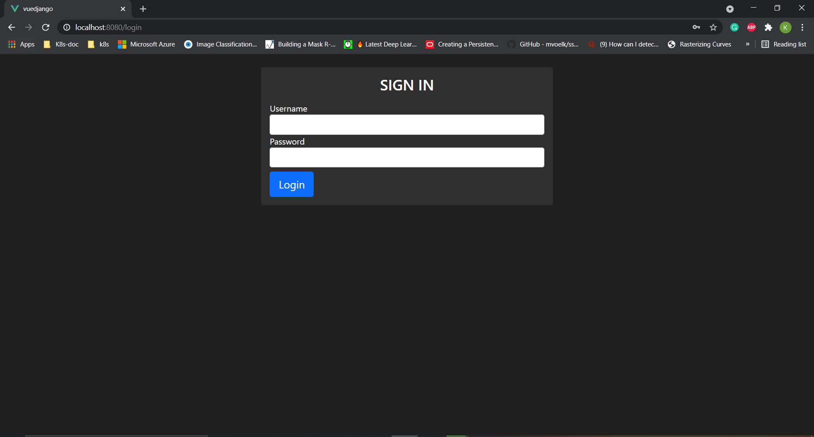
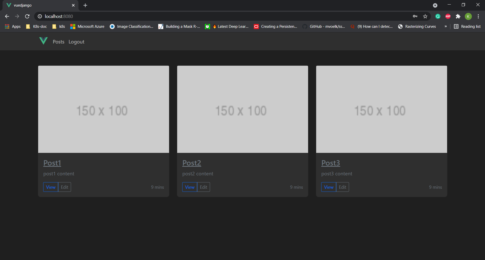

# vuedjango

[](https://vuejs.org/)

[](https://vuex.vuejs.org/)

This is a simple client web application build with `Vue` and using backend as `Django` to get data from it. It has functionality of handling user session using `local storage`.

## DEMO
<br />
<figure>
    
    <figcaption>Login Page</figcaption>
</figure>
<br />
<figure>
    
    <figcaption>Posts Page</figcaption>
</figure>

## Project setup
```
npm install
```

### Compiles and hot-reloads for development
```
npm run serve
```

### Compiles and minifies for production
```
npm run build
```

### Customize configuration
See [Configuration Reference](https://cli.vuejs.org/config/).
