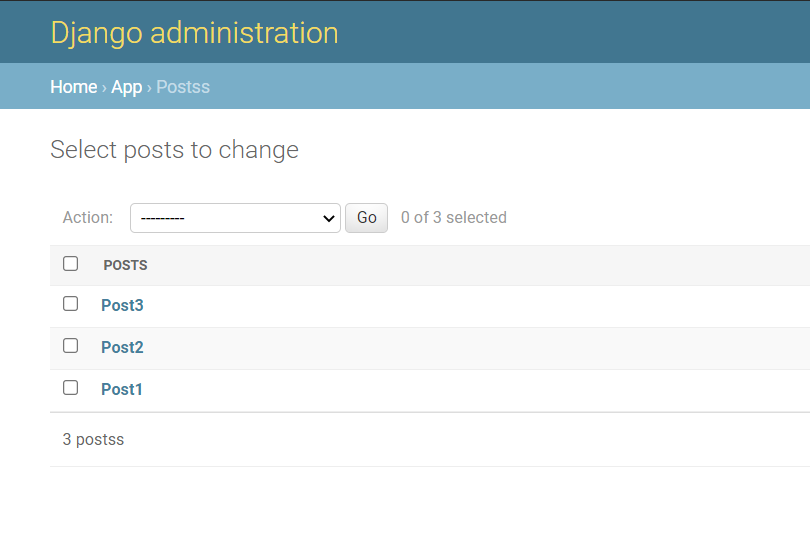
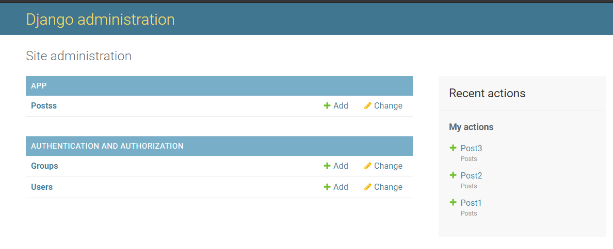

# restbackend

[](https://www.djangoproject.com/)

[](https://www.django-rest-framework.org/)

[](https://github.com/jazzband/djangorestframework-simplejwt)

This is a simple Django App which will create API from the data stored in sqlite database using `admin` account and it's also having `JWT` integrated to make API <b>SECURE</b>

## DEMO
<br />
<figure>
    
    <figcaption>Posts Data</figcaption>
</figure>
<br />
<figure>
    
    <figcaption>Home Page</figcaption>
</figure>

## Project setup
```
pip install -r requirements.txt
python manage.py makemigrations
python manage.py migrate
```

### Run server for development
```
python manage.py runserver
```
